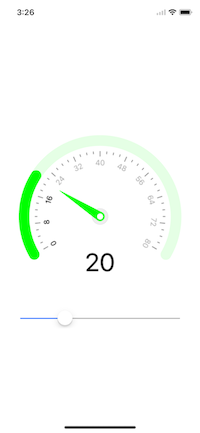

# SmartGauge

Customizable iOS Gauge.



## Example
To run the example project, clone the repo, and run `pod install` from the Example directory first.

## Requirements
- Swift Version : 5.+
- iOS Version: 10.+

## Installation

To install SmartGauge, simply add the following line to your Podfile:

```swift
pod 'SmartGauge'
```

## Usage
```swift
import SmartGauge
```

Add a UIView to the Storyboard/Xib and update the class to `SmartGauge`.
Create an outlet and configure as per your need.

```swift
gaugeView.numberOfMajorTicks = 10
gaugeView.numberOfMinorTicks = 3
gaugeView.gaugeMaxValue = 300
gaugeView.gaugeAngle = 60
gaugeView.gaugeTrackColor = UIColor.blue
gaugeView.gaugeValue = 20
```

You can also setup the gauge by using `SGRanges` with differnt range values & colors.
```swift
	let first = SGRanges("first", fromValue: 0, toValue: 20, color: .blue)
	let second = SGRanges("second", fromValue: 20, toValue: 40, color: .green)
	let third = SGRanges("third", fromValue: 40, toValue: 80, color: .red)

	gaugeView.rangesList = [first, second, third]
	gaugeView.gaugeMaxValue = third.toValue
```

## Author

Rameez Ibrahim

## License

SmartGauge is available under the MIT license. See the LICENSE file for more info.
